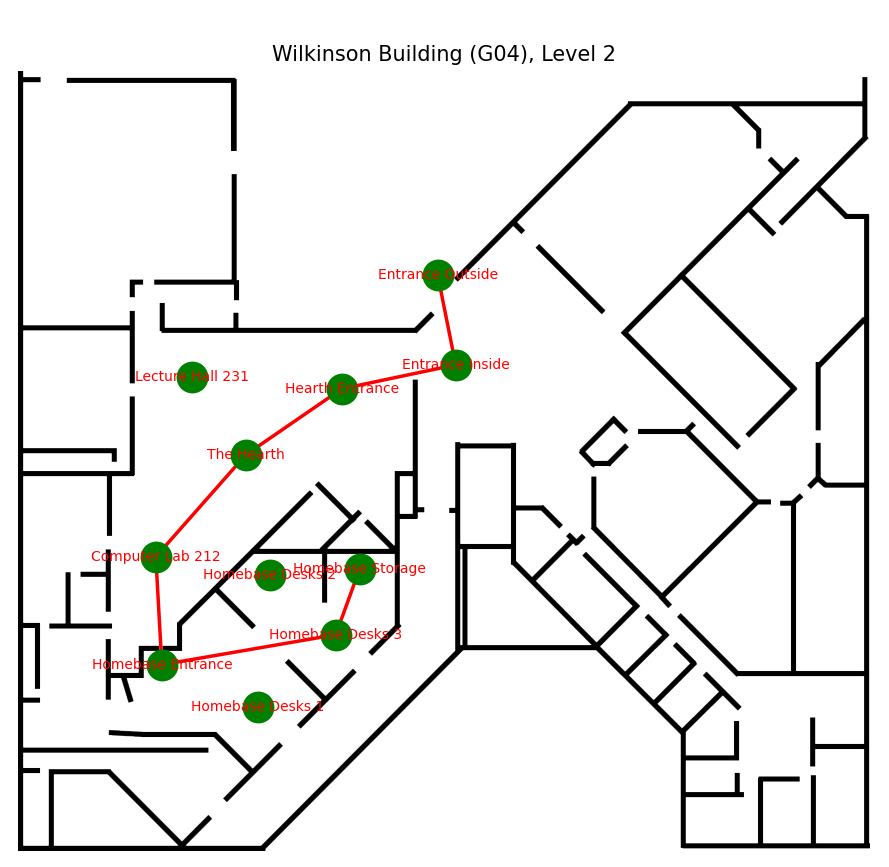

# Wayfinding
## Rationale
Wayfinding seeks to create a better way for indoor pathfinding, currently in the context of large building complexes such as university campuses. Among the technical difficulties of using GPS system indoors, there are other factors that encourages us to explore this problem such as difficulty of users to manually localize their surroundings, relying on visual cues like maps and signage which leads to unnecessary cognitive strain and confusion.

## Foreword
For some reason the program is not very reliable in providing an output on the web interface but the correct output is stated via its Observation stage. Currently the most reliable one is getting the shortest path via Djikstra.

Please note that when you do Step 2, there may be errors stating your MAC address is not found, this is due to the strongest signal changing if you have a router that has both 2.6G or 5G. 

Alternatively, remove `strongest_node_address` in 'chatbot.py' (line 54 and 56) with a MAC address the same in line 2.

## Instructions
1. Clone the repository 
2. **IMPORTANT:** To simulate your router as the starting point for the pathfinding, rename `YOUR ROUTER ADDRESS` in 'database.py' (line 2) to your own router MAC address.
3. In chatbot.py (line 109) input your API key in `openai_api_key="apikey"`
4. To test the app, run only the file 'chatbot.py' which will create a web app from streamlit. Make sure to type `streamlit run chatbot.py` in the console to run the app.
5. If you want to use the LLM, ensure the location names are taken from list `location_names` from database.py. Capitalization and spaces are important and can affect if it works or not.
6. Please only use two locations when finding a path to. The program is not able to find a path to more than two locations.

